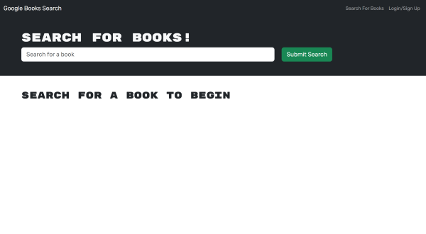
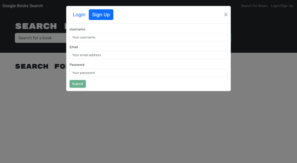
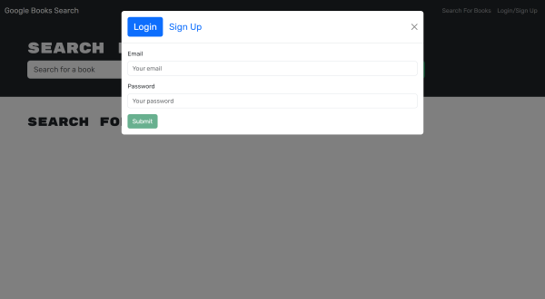
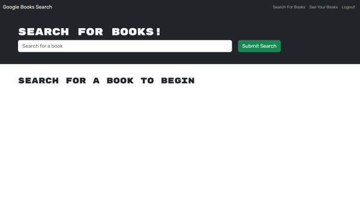
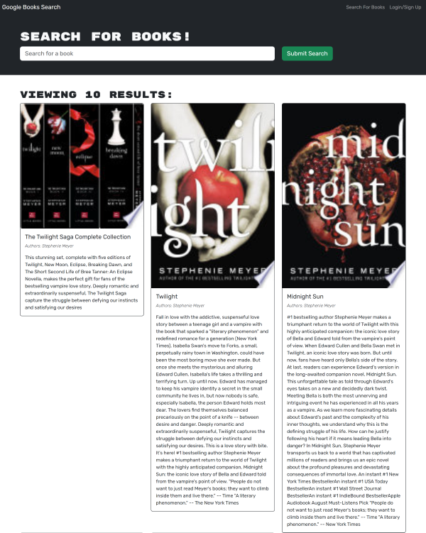
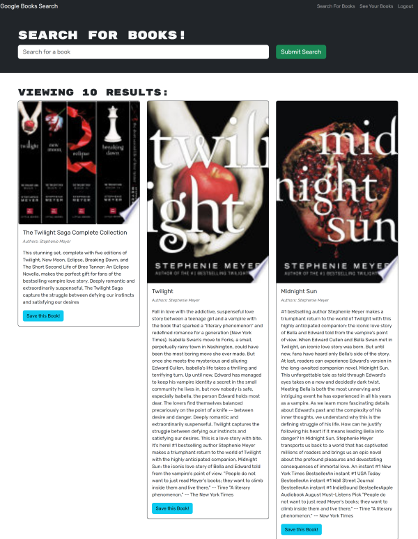
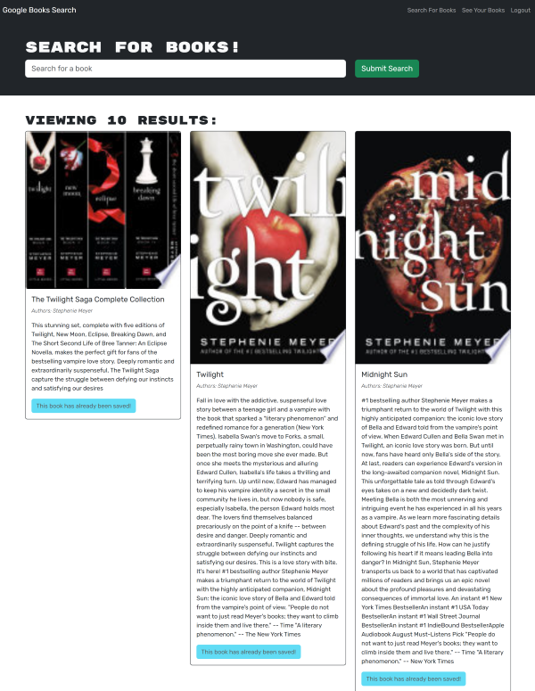
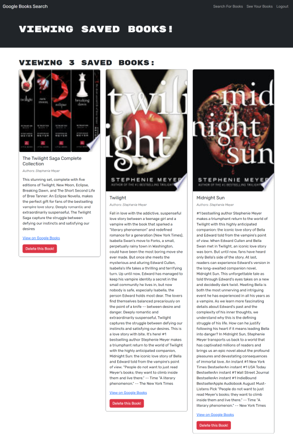
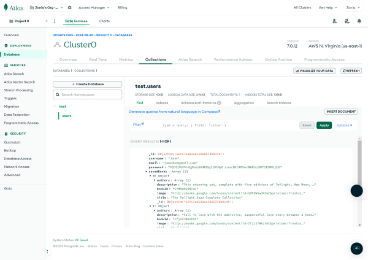

# MERN Book Search Engine

## Table of Contents
- [Description](#description)
- [Installation](#installation)
- [Usage](#usage)
- [Features](#features)
- [Technologies](#technologies)
- [Screenshots](#screenshots)
- [Links](#links)

## Description
The MERN Book Search Engine is a full-stack web application that allows users to search for books and save their favorite ones. It leverages the MERN stack (MongoDB, Express.js, React, Node.js) to provide a seamless and interactive user experience.

## Installation

```
npm install
```

```
npm run build
```


## Usage

```
npm start
```


## Features
- Search for books using the Google Books API.
- Save favorite books to a personal list.
- View detailed information about each book.
- Remove books from the saved list.

## Technologies
- **Frontend**: React, Bootstrap
- **Backend**: Node.js, Express.js
- **Database**: MongoDB, Mongoose
- **Authentication**: JSON Web Tokens (JWT)
- **API**: Google Books API

## Screenshots




















## Links

[Live URL](https://mern-book-search-engine-txww.onrender.com)

[GitHub Repo](https://github.com/zoniaramirez/mern-book-search-engine)

